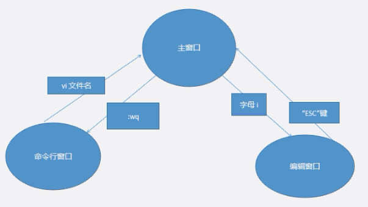

## 汇总表格

|           命令            |               全称                |                                                                                                 描述                                                                                                  |
|:-----------------------:|:-------------------------------:|:---------------------------------------------------------------------------------------------------------------------------------------------------------------------------------------------------:|
|          alias          |              alias              |                                                                                               给命令起别名                                                                                                |
|           awk           |   Aho Weiberger and Kernighan   |                                                                                            三个作者的姓的第一个字母                                                                                             |
|          bash           |     GNU Bourne-Again Shell      |                                                                                           大多Linux的默认shell                                                                                           |
|           bc            |        basic calculator         |                                                                                       基础计算器，scale设定小数位，quit退出                                                                                       |
|           bg            |           background            |                                                                                               后台运行任务                                                                                                |
|           bye           |               bye               |                                                                                           用于在FTP时退出FTP执行                                                                                            |
|           cal           |            calendar             |                                                                                        日历，后跟月份数、年份数可显示指定月日历                                                                                         |
|           cat           |            catenate             |                                                                                输出文件内容，-n显示行号，-b不显示空行，有意思的是tac则从后向前输出                                                                                |
|           cd            |        change directory         |                                                                                                切换目录                                                                                                 |
|          chgrp          |          change group           |                                                                                              改变文件归属用户组                                                                                              |
|          clear          |              clear              |                                                                                                 清屏                                                                                                  |
|          chmod          |           change mode           |                                                                       改变读写权限，-R递归更改，a默认所有用户u本用户g本群组o其他用户，+-rwx增减读写执行权限，rwx421                                                                       |
|          chown          |          change owner           |                                                                                                改变所有者                                                                                                |
|           cp            |              copy               |                                                                                                 复制                                                                                                  |
|         crontab         |             chronos             |                                                           定时执行工具，* * * * *分别为分时日月星期*，代表所有，"-"为范围","为多值"/"为频率，-u指定用户，-l查看任务，-r删除任务，-e编辑任务。                                                           |
|           cut           |               cut               |                                                                      从文件中的每行文本中剪出指定字符，功能类似grep，-b以字节为单位，-c以字符为单位，-d自定义分隔符默认制表符                                                                      |
|          date           |              date               |                                         日期时间，date "+option"，-d显示指定时间，-r显示文件最后修改时间，-s修改时间，%x日期，%X时间，%F日期，%D月日年，%Y4位年份，%y2位年份，%m月份，%d日，%H24制时，%I12制时，%M分，%S秒                                          |
|         declare         |             declare             |                                                                                      用于声明shell变量，-a数组，-i指定整数型                                                                                       |
|           df            |            disk free            |                                                                                剩余磁盘空间，-h以适阅读单位显示，后跟文件则显示其所在挂载点磁盘剩余空间                                                                                |
|          dirs           |           directories           |                                               从目录栈中读取，功能类似于一个数组，先显示本目录再显示目录栈，-c删除目录栈中所有记录，-p每行显示一个（默认连续显示），-v每行显示一个并加编号，+N显示第N个目录（数字从0开始），-N显示倒数第N个目录                                               |
|           du            |           disk usage            |                                                                       磁盘使用情况，统计文件大小，-h以适阅读单位显示，-s不迭代仅合计统计，--max-depth n指定统计深度                                                                       |
|          egrep          |          extended GREP          |                                                                                            可使用扩展正则的grep                                                                                             |
|          exec           |             execute             |                                                                                              执行 ，内部命令                                                                                               |
|          find           |              find               |                   查找，find PATH -OPTION [-print] [-exec cmd] {} ;，PATH为查找数据若为当前目录下则为“.”，-name文件名，-mtime +/- N N天前或内更改的文件，-ctime +/-N N天前或内创建的文件，-type文件类型d为目录f为文件，-size 大于指定字节的文件                    |
|           fg            |           foreground            |                                                                                               前台运行任务                                                                                                |
|           fmt           |             format              |                                                                                              简单的文本格式化                                                                                               |
|           ftp           |     file transfer protocol      |                                                                   文件传输，后跟IP地址，get从远程FTP机下载到本机，mget批量下载，put将本机文件上传到远程FTP机，mput批量上传                                                                   |
|          free           |              free               |                                                                              内存使用情况，-s间隔N秒查询一次，-m -k -b以M、KB、Byte为单位显示                                                                              |
|          gawk           |             GNU AWK             |                                                                                                  -                                                                                                  |
|          grep           | global regular expression print |                                                                 全局正则表达式打印，强大的文本搜索工具，-c只输出计数，-i忽略大小写，-n输出行号，-v取反，-h多文件时不显文件名，-r递归搜索                                                                  |
|          head           |              head               |                                                                                                查看前n行                                                                                                |
|         iostat          |          in out status          |                                                                                              IO及CPU状态                                                                                               |
|         iostat          |          in out status          |                                                                                              IO及CPU状态                                                                                               |
|          less           |              less               |                                                                                              分页展示文件内容                                                                                               |
|         logname         |           login name            |                                                                                              显示当前登录用户名                                                                                              |
|           ln            |              link               |                                                                                         建立链接，-s建立软链接（默认硬链接）                                                                                         |
|         locate          |             locate              |                                                                        查找文件地址，并不查硬盘，而是在/var/lib/slocate/slocate.db中查看，速度快省资源                                                                        |
|           ls            |              list               |                                                                                 列出文件，-l详细信息，-h合适单位显示，-S大小排序，-t时间排序                                                                                  |
|          lsof           |         list open files         |                                                     列出当前系统打开的文件，ROOT权限，-c某进程打开的文件，-p某进程打开的文件，-u某用户打开的文件，跟目录为目录下打开的文件，跟文件为文件相关打开信息，-i某端口或IP打开的文件                                                     |
|           man           |             manual              |                                                                                       意思是手册，可以用这个命令查询其他命令的用法。                                                                                       |
|          mkdir          |         make directory          |                                                                                         创建目录，-p指定路径，-m指定权限                                                                                          |
|           mv            |              move               |                                                                   移动文件，同目录下则为重命名，-i询问试覆盖，-f同名强制覆盖，-b备份旧文件（文件名后加~），-u若本文件较新则覆盖旧文件                                                                    |
|          more           |              more               |                                                                                                分页显示                                                                                                 |
|           nl            |         number of lines         |                                                                    计算文件行号，类似cat，-b a 计算空行（默认不计算），-n rz以6位数字显示行号前补0，-w指定占位数（默认6）                                                                     |
|         passwd          |            password             |                                                                                                修改密码                                                                                                 |
|           pg            |              pager              |                                                                                              分页显示文件内容                                                                                               |
|          ping           |     packet interNet grouper     |                                                                                        测试网络，-c指定次数，-i指定间隔秒数                                                                                         |
|         printf          |          print format           |                                                                                               格式化输出文本                                                                                               |
|           ps            |        processes status         |                                          进程状态 ，命令执行时刻进程信息，-a同终端进程，-A所有进程，-u指定用户，-e同-A，-f展示所有信息，aux查看进程详细信息类似-ef，-C可跟搜索词，--sort=-pcpu,+pmem按cpu降序按mem内存升序排序                                          |
|          pushd          |         push directory          |                                                                          当目录放入目录栈，+/-N将正数/倒数第N个目录移到栈顶并切换到该目录，-n在切目录栈时不切目录                                                                           |
|          popd           |          pop directory          |                                                                                   从目录栈弹出目录，+/-N将正数/倒数第N个目录从目录栈中移除                                                                                   |
|           pwd           |     print working directory     |                                                                                               打印工作目录                                                                                                |
|           rcp           |           remote copy           |                                                                               远程拷贝，-r递归，-p保留修改时间和权限，将远程文件拷贝到本机，限制条件较多                                                                               |
|           rm            |             remove              |                                                                                         删除文件，-r递归，-f不询问强制删除                                                                                         |
|          rmdir          |        remove directory         |                                                                                                删除目录                                                                                                 |
|         rlogin          |          remote login           |                                                                                       -l指定登录用户名，rlogin IP/主机名                                                                                       |
|           rsh           |          remote shell           |                                                                                          远程执行shell，-l指定用户                                                                                           |
|           rpm           |     RedHat package manager      | RedHat软件包管理工具，类似Windows里面的“添加/删除程序”，-a查询所有，-e卸载，-h显示进度，-i显示相关信息，-l列出软件所有文件名，-q查询，-p软件包内文件，-v显示执行过程；常用参数：-ivh安装并显示进度，-qpl查看软件包内文件，-qa查询一个软件是否安装过，--relocate指定安装目录，--rebuild编译+打包，--recompile编译+打包+安装 |
|         reboot          |        restart computer         |                                                                                                重启计算机                                                                                                |
|           scp           |           secure copy           |                                                                         用于Linux间复制，基于ssh远程复制，-p保留修改时间权限，-r递归，-P指定端口，-v显示进度，                                                                         |
|           sed           |          Stream Editor          |             流编辑器，本身即先查，在CMD中匹配字符两侧要有//，sed -OPTION 'CMD' file，选项：-n安静模式，-i直接修改不屏幕输出，-r支持扩展正则，-e多命令，-f文件指定动作；命令：a增，d删除，i插，c改，s正则查，p屏幕输出，g获取内存缓冲区内容并替代当前模板块中文字，G获取内容追加，h内容拷贝到内存，H内容追加到内存              |
|           set           |               set               |                                                              主要作用是显示系统中已经存在的shell变量，以及设置shell变量的新变量值，不能够定义新的shell变量，定义新的变量使用declare命令。                                                              |
|        shutdown         |            shutdown             |                                                                     关机，-t设定延迟时间，-k通知所有用户，-r重启，-h关机后停机，-c取消关机，-f强制关机，time设定关机时间                                                                      |
|          sleep          |              sleep              |                                                                                                动作延迟                                                                                                 |
|          sort           |              sort               |                                                                     排序，-b忽略行首空格，-r反向，-n以数值，-o排序结果输出文件，-t指定列分隔符，-k指定排序列，-f忽略大小写                                                                      |
|      split = split      |           将大文件分割成小文件            |                                                                              - N每N行分割成一个文件，-bN每N字节分割成一个文件，-C按字节分割保证完整性                                                                              |
|           ssh           |          Secure Shell           |                                                                                       远程登录Linux，-l指定用户，-p指定端口                                                                                       |
|         sshpass         |             sshpass             |                                                                                            一款ssh免密码输入软件                                                                                             |
|           su            |           switch user           |                                                             切换用户，root切任何用户不需要密码，但其他用户之间切换需要密码，- user表示切换到用户user并将用户环境一并切换，-c执行命令再退回原用户                                                              |
|          sudo           |          super user do          |                                                                                               受限制的su                                                                                                |
|           svn           |           sub version           |                                                                                               版本控制系统                                                                                                |
|          sync           |              sync               |                                                                                              强制将内存写入硬盘                                                                                              |
|           tar           |          tape archive           |                                              打包归档文件，-c创建create，-x提取extract，-t查看list，-f指定归档文件，-m解压时不变更文件更改时间，-p解压时原权限不变，-v显示执行详情，-r向归档文件中追加，-u更新归档文件中文件                                              |
|          tail           |              tail               |                                                                                               查看尾部n行                                                                                                |
|          touch          |              touch              |                                                                         创建，修改文件或者目录的时间属性，若文件不存在，系统会建立一个新的文件，更改文件权限再结合chmod                                                                          |
|           top           |               top               |                                                                           实时显示系统中各个进程的资源占用状况，该命令可以按CPU使用、内存使用和执行时间对任务进行排序                                                                           |
|         umount          |             unmount             |                                                                                         卸载，可以通过设备名卸载或挂载点卸载                                                                                          |
|          unset          |              unset              |                                                                                              用于删除变量或函数                                                                                              |
| useradd、userdel、usermod |     useradd、userdel、usermod     |                                                                                           新增用户、删除用户、修改用户                                                                                            |
|            w            |               who               |                                                                                            显示目前登入系统的用户信息                                                                                            |
|          xargs          |       eXtended ARGuments        |                                                                     给命令传递参数的一个过滤器，也是组合多个命令的一个工具，它把一个数据流分割为一些足够小的块，以方便过滤器和命令进行处理                                                                     |
|           wc            |           word count            |                                                                            计算文件的Byte数、字数、或是列数，-c只显示字节数，-l只显示行数，-w只统计单词数                                                                             |
|           who           |               who               |                                                                                           显示当前系统所有使用者等信息                                                                                            |
|         whoami          |             whoami              |                                                                                            命令用于显示自身用户名称。                                                                                            |
|          which          |              which              |                                                                                              命令用于查找文件                                                                                               |
|         whereis         |            where is             |                                                                                               查看文件位置                                                                                                |

## 部分常用命令

### `whoami` - 查看当前登录用户

### `pwd` - 查看当前所在位置

### `cd`  路径 - 进入指定的文件夹

1. 绝对路径 -- 从根目录开始写的路径 -- 例：`cd /home/test`

2. 相对路径 -- 从当前目录开始写的路径

   ​                   `..`表示从当前目录向外走 -- 例：`cd ../../home`

   ​                   `.`表示从当前目录向里走 -- 例：`cd ./home `(’`./` 可省略，变为 `cd /home`)

### `ls ` - 查看当前目录下内容

`ls -l` -- 查看当前目录下内容的详细信息

`ll` -- 等同于`ls -l`

### `touch 文件名` - 创建一个文件

### `mkdir 文件夹名` - 创建一个文件夹

### `rm 文件名` - 删除一个文件

### `rmdir 文件夹名` - 删除一个空文件夹

### `rm -r 非空文件夹` - 递归删除一个非空文件夹

删除其中每个文件时都会询问

### `rm -rf 非空文件夹` - 递归强制删除一个非空文件夹

删除多个文件夹时，可用空格分隔：`rm -rf dir1 ../dir2 /home/dir3`

删除文件夹内容，但保留文件夹本身：`rm -rf dir/*`

删库跑路：`rm -rf /*`

### `more 文件名` - 读取文件内容

### `vi`  - 编辑器

- `:wq`是保存退出；`:q!`是不保存退出
- `vi 新文件名` 可直接创建文件并编辑

### `ping IP` - 测试网络连接

### `chmod 777 文件名` - 给文件赋权限

### `rpm -i 安装文件名` - 安装rpm文件

## 其它

重启网络：`systemctl restart network`

关闭防火墙：`sudo systemctl disable firewalld` 
