# 基础类型

TS是JS的超集，所以JS基础的类型都包含在内

**起步安装 npm install typescript -g**

**运行tsc 文件名**

基础类型：Boolean、Number、String、null、undefined&nbsp;以及 ES6
的&nbsp;&nbsp; [Symbol](http://es6.ruanyifeng.com/#docs/symbol)&nbsp;和 ES10
的&nbsp; [BigInt](https://developer.mozilla.org/zh-CN/docs/Web/JavaScript/Reference/Global_Objects/BigInt)。

## 1.字符串类型

字符串是使用string定义的

```typescript
let a: string = '123'
//普通声明

//也可以使用es6的字符串模板
let str: string = `dddd${a}`
```

其中&nbsp;`
&nbsp;用来定义&nbsp; [ES6 中的模板字符串](http://es6.ruanyifeng.com/#docs/string%23%E6%A8%A1%E6%9D%BF%E5%AD%97%E7%AC%A6%E4%B8%B2)
，${expr}&nbsp;用来在模板字符串中嵌入表达式。

## 2.数字类型

支持十六进制、十进制、八进制和二进制；

```typescript
let notANumber: number = NaN;//Nan
let num: number = 123;//普通数字
let infinityNumber: number = Infinity;//无穷大
let decimal: number = 6;//十进制
let hex: number = 0xf00d;//十六进制
let binary: number = 0b1010;//二进制
let octal: number = 0o744;//八进制s
```

## 3.布尔类型

注意，使用构造函数 Boolean 创造的对象不是布尔值：

```typescript
let createdBoolean: boolean = new Boolean(1)
//这样会报错 应为事实上 new Boolean() 返回的是一个 Boolean 对象 
```

事实上 new Boolean() 返回的是一个 Boolean 对象&nbsp;需要改成

```typescript
let createdBoolean: Boolean = new Boolean(1)
```

```typescript
let booleand: boolean = true //可以直接使用布尔值

let booleand2: boolean = Boolean(1) //也可以通过函数返回布尔值
```

## 4.其它

JavaScript 没有空值（Void）的概念，在 TypeScript 中，可以用&nbsp;void&nbsp;表示没有任何返回值的函数

```typescript
function voidFn(): void {
  console.log('test void')
}
```

void&nbsp;类型的用法，主要是用在我们**不希望**调用者关心函数返回值的情况下，比如通常的**异步回调函数**

**void也可以定义undefined 和 null类型**

```typescript
let u: void = undefined
let n: void = null;
```

```typescript
let u: undefined = undefined;//定义undefined
let n: null = null;//定义null
```

**void 和 undefined 和 null 最大的区别**

**与 void 的区别是，undefined 和 null 是所有类型的子类型。也就是说 undefined 类型的变量，可以赋值给 string 类型的变量：**

```typescript
//这样写会报错 void类型不可以分给其他类型
let test: void = undefined
let num2: string = "1"

num2 = test
```

```typescript
//这样是没问题的
let test: null = null
let num2: string = "1"

num2 = test

//或者这样的
let test: undefined = undefined
let num2: string = "1"

num2 = test
```

**TIPS 注意：**

如果你配置了tsconfig.json 开启了严格模式，那么null就不能赋予void类型

```typescript
{
  "compilerOptions"
:
  {
    "strict"
  :
    true
  }
}
```

# 任意类型

## Any 类型 和 unknown 顶级类型

```typescript
nodejs
环境执行ts
npm
i
@types/
node--
save - dev （node环境支持的依赖必装）
npm
i
ts - node--
g
```

1.没有强制限定哪种类型，随时切换类型都可以&nbsp;我们可以对 any 进行任何操作，不需要检查类型

```typescript
let anys: any = 123
anys = '123'
anys = true
```

2.声明变量的时候没有指定任意类型默认为any

```typescript
let anys;
anys = '123'
anys = true
```

3.弊端如果使用any 就失去了TS类型检测的作用

4.TypeScript 3.0中引入的 unknown 类型也被认为是 top type ，但它更安全。与 any 一样，所有类型都可以分配给unknown

unknow&nbsp; unknow类型比any更加严格当你要使用any 的时候可以尝试使用unknown

```typescript
//unknown 可以定义任何类型的值
let value: unknown;

value = true;             // OK
value = 42;               // OK
value = "Hello World";    // OK
value = [];               // OK
value = {};               // OK
value = null;             // OK
value = undefined;        // OK
value = Symbol("type");   // OK

//这样写会报错unknow类型不能作为子类型只能作为父类型 any可以作为父类型和子类型
//unknown类型不能赋值给其他类型
let names: unknown = '123'
let names2: string = names

//这样就没问题 any类型是可以的
let names: any = '123'
let names2: string = names

//unknown可赋值对象只有unknown 和 any
let bbb: unknown = '123'
let aaa: any = '456'

aaa = bbb
```

区别2

```typescript
如果是any类型在对象没有这个属性的时候还在获取是不会报错的
let obj: any = { b: 1 }
obj.a


如果是unknow
是不能调用属性和方法
let obj: unknown = { b: 1, ccc: (): number => 213 }
obj.b
obj.ccc()
```

# 对象类型

在 [typescript](https://so.csdn.net/so/search?from=pc_blog_highlight&q=typescript)中，我们定义对象的方式要用关键字*
*interface**（接口），我的理解是使用**interface**来定义一种约束，让数据的结构满足约束的格式。定义方式如下：

```typescript
//这样写是会报错的 因为我们在person定义了a，b但是对象里面缺少b属性
//使用接口约束的时候不能多一个属性也不能少一个属性
//必须与接口保持一致
interface Person {
  b: string,
  a: string
}

const person: Person = {
  a: "213"
}
```

```typescript
//重名interface  可以合并
interface A {name: string}

interface A {age: number}

var x: A = { name: 'xx', age: 20 }

//继承
interface A {
  name: string
}

interface B extends A {
  age: number
}

let obj: B = {
  age: 18,
  name: "string"
}
```

## 可选属性 使用?操作符

```typescript
//可选属性的含义是该属性可以不存在
//所以说这样写也是没问题的
interface Person {
  b?: string,
  a: string
}

const person: Person = {
  a: "213"
}
```

## 任意属性 [propName: string]

需要注意的是，一旦定义了任意属性，那么确定属性和可选属性的类型都必须是它的类型的子集：

```typescript
//在这个例子当中我们看到接口中并没有定义C但是并没有报错
//应为我们定义了[propName: string]: any;
//允许添加新的任意属性
interface Person {
  b?: string,
  a: string,

  [propName: string]: any;
}

const person: Person = {
  a: "213",
  c: "123"
}
```

## 只读属性 readonly

readonly 只读属性是不允许被赋值的只能读取

```typescript
//这样写是会报错的
//应为a是只读的不允许重新赋值
interface Person {
  b?: string,
  readonly a: string,

  [propName: string]: any;
}

const person: Person = {
  a: "213",
  c: "123"
}

person.a = 123
```

```typescript
interface Person {
  b?: string,
  readonly a: string,

  [propName: string]: any;

  cb: () => void
}

const person: Person = {
  a: "213",
  c: "123",
  cb: () => {
    console.log(123)
  }
}
```

# 数组类型

## 类型[ ]

```typescript
//类型加中括号
let arr: number[] = [123]
//这样会报错定义了数字类型出现字符串是不允许的
let arr: number[] = [1, 2, 3, '1']
//操作方法添加也是不允许的
let arr: number[] = [1, 2, 3,]
arr.unshift('1')


var arr: number[] = [1, 2, 3]; //数字类型的数组
var arr2: string[] = ["1", "2"]; //字符串类型的数组
var arr3: any[] = [1, "2", true]; //任意类型的数组
```

## 数组泛型

规则 Array&lt;类型&gt;

```typescript
let arr: Array<number> = [1, 2, 3, 4, 5]
```

## 用接口表示数组

一般用来描述类数组&nbsp;

```typescript
interface NumberArray {
  [index: number]: number;
}

let fibonacci: NumberArray = [1, 1, 2, 3, 5];
//表示：只要索引的类型是数字时，那么值的类型必须是数字。
```

## 多维数组

```typescript
let data: number[][] = [[1, 2], [3, 4]];
```

## arguments类数组

```typescript
function Arr(...args: any): void {
  console.log(arguments)
  //错误的arguments 是类数组不能这样定义
  let arr: number[] = arguments
}

Arr(111, 222, 333)


function Arr(...args: any): void {
  console.log(arguments)
  //ts内置对象IArguments 定义
  let arr: IArguments = arguments
}

Arr(111, 222, 333)

//其中 IArguments 是 TypeScript 中定义好了的类型，它实际上就是：
interface IArguments {
  [index: number]: any;

  length: number;
  callee: Function;
}
```

## any 在数组中的应用

一个常见的例子数组中可以存在任意类型

```typescript
let list: any[] = ['test', 1, [], { a: 1 }]
```

# 函数扩展

```typescript
//注意，参数不能多传，也不能少传 必须按照约定的类型来
const fn = (name: string, age: number): string => {
  return name + age
}
fn('张三', 18)
```

## 函数的可选参数?

```typescript
//通过?表示该参数为可选参数
const fn = (name: string, age?: number): string => {
  return name + age
}
fn('张三')
```

## 函数参数的默认值

```typescript
const fn = (name: string = "我是默认值"): string => {
  return name
}
fn()
```

## 接口定义函数

```typescript
//定义参数 num 和 num2  ：后面定义返回值的类型
interface Add {
  (num: number, num2: number): number
}

const fn: Add = (num: number, num2: number): number => {
  return num + num2
}
fn(5, 5)


interface User {
  name: string;
  age: number;
}

function getUserInfo(user: User): User {
  return user
}
```

## 定义剩余参数

```typescript
const fn = (array: number[], ...items: any[]): any[] => {
  console.log(array, items)
  return items
}

let a: number[] = [1, 2, 3]

fn(a, '4', '5', '6')
```

## 函数重载

重载是方法名字相同，而参数不同，返回类型可以相同也可以不同。

如果参数类型不同，则参数类型应设置为&nbsp;**any**。

参数数量不同你可以将不同的参数设置为可选。

```typescript
function fn(params: number): void

function fn(params: string, params2: number): void

function fn(params: any, params2?: any): void {
  console.log(params)
  console.log(params2)

}


fn(123)

fn('123', 456)
```

# 类型断言 | 联合类型 | 交叉类型

## 类型断言

语法： 值 `as` 类型 或  <类型>值

```
interface A {
	run: string
}

interface B {
	build: string
}

const fn = (type: A | B): string => {
       return type.run
}
```

上述写法是有警告的应为B的接口上面是没有定义`run`这个属性的

使用断言：

```
const fn = (type: A | B): string => {
       return (type as A).run
}
```

需要注意的是，类型断言只能够「欺骗」TypeScript 编译器，无法避免运行时的错误，滥用类型断言可能会导致运行时错误

### 使用any临时断言

```
window.abc = 123
//这样写会报错因为window没有abc这个东西

(window as any).abc = 123
//可以使用any临时断言在 any 类型的变量上，访问任何属性都是允许的
```

### as const

如果是普通类型跟直接const声明是一样的

```
const names = '小满'
names = 'aa' //无法修改
 
let names2 = '小满' as const
names2 = 'aa' //无法修改
```

但还是有些区别的

```
// 数组
let a1 = [10, 20] as const;
const a2 = [10, 20];
 
a1.unshift(30); // 错误，此时已经断言字面量为[10, 20],数据无法做任何修改
a2.unshift(30); // 通过，没有修改指针
```

**类型断言是不具备影响力的**，在下面的例子中，将 `something`  断言为 `boolean` 虽然可以通过编译，但是并没有什么用，并不会影响结果，因为编译过程中会删除类型断言

```
function toBoolean(something: any): boolean {
    return something as boolean;
}
 
toBoolean(1);
// 返回值为 1
```

## 联合类型

```
//例如我们的手机号通常是13XXXXXXX 为数字类型 这时候产品说需要支持座机
//所以我们就可以使用联合类型支持座机字符串
let myPhone: number | string  = '010-820'
 
//下方写法是会报错的,因为我们的联合类型只有数字和字符串并没有布尔值
let myPhone: number | string  = true
```

函数使用联合类型

```
const fn = (something:number | boolean):boolean => {
     return !!something
}
```

## 交叉类型

多种类型的集合，联合对象将具有所联合类型的所有成员

```
interface People {
  age: number,
  height： number
}
interface Man{
  sex: string
}
const xiaoman = (man: People & Man) => {
  console.log(man.age)
  console.log(man.height)
  console.log(man.sex)
}
xiaoman({age: 18,height: 180,sex: 'male'});
```

# 内置对象

JavaScript 中有很多 [内置对象](https://developer.mozilla.org/en-US/docs/Web/JavaScript/Reference/Global_Objects)，它们可以直接在
TypeScript 中当做定义好了的类型。

## ECMAScript 的内置对象

Boolean、Number、string、RegExp、Date、Error

```typescript
let b: Boolean = new Boolean(1)
console.log(b)
let n: Number = new Number(true)
console.log(n)
let s: String = new String('string')
console.log(s)
let d: Date = new Date()
console.log(d)
let r: RegExp = /^1/
console.log(r)
let e: Error = new Error("error!")
console.log(e)
```

## DOM 和 BOM 的内置对象

Document、HTMLElement、Event、NodeList 等

```typescript
let body: HTMLElement = document.body;
let allDiv: NodeList = document.querySelectorAll('div');
//读取div 这种需要类型断言 或者加个判断，因为若读不到则返回null
let div: HTMLElement = document.querySelector('div') as HTMLDivElement
document.addEventListener('click', function (e: MouseEvent) {

});

//dom元素的映射表
interface HTMLElementTagNameMap {
  "a": HTMLAnchorElement;
  "abbr": HTMLElement;
  "address": HTMLElement;
  "applet": HTMLAppletElement;
  "area": HTMLAreaElement;
  "article": HTMLElement;
  "aside": HTMLElement;
  "audio": HTMLAudioElement;
  "b": HTMLElement;
  "base": HTMLBaseElement;
  "bdi": HTMLElement;
  "bdo": HTMLElement;
  "blockquote": HTMLQuoteElement;
  "body": HTMLBodyElement;
  "br": HTMLBRElement;
  "button": HTMLButtonElement;
  "canvas": HTMLCanvasElement;
  "caption": HTMLTableCaptionElement;
  "cite": HTMLElement;
  "code": HTMLElement;
  "col": HTMLTableColElement;
  "colgroup": HTMLTableColElement;
  "data": HTMLDataElement;
  "datalist": HTMLDataListElement;
  "dd": HTMLElement;
  "del": HTMLModElement;
  "details": HTMLDetailsElement;
  "dfn": HTMLElement;
  "dialog": HTMLDialogElement;
  "dir": HTMLDirectoryElement;
  "div": HTMLDivElement;
  "dl": HTMLDListElement;
  "dt": HTMLElement;
  "em": HTMLElement;
  "embed": HTMLEmbedElement;
  "fieldset": HTMLFieldSetElement;
  "figcaption": HTMLElement;
  "figure": HTMLElement;
  "font": HTMLFontElement;
  "footer": HTMLElement;
  "form": HTMLFormElement;
  "frame": HTMLFrameElement;
  "frameset": HTMLFrameSetElement;
  "h1": HTMLHeadingElement;
  "h2": HTMLHeadingElement;
  "h3": HTMLHeadingElement;
  "h4": HTMLHeadingElement;
  "h5": HTMLHeadingElement;
  "h6": HTMLHeadingElement;
  "head": HTMLHeadElement;
  "header": HTMLElement;
  "hgroup": HTMLElement;
  "hr": HTMLHRElement;
  "html": HTMLHtmlElement;
  "i": HTMLElement;
  "iframe": HTMLIFrameElement;
  "img": HTMLImageElement;
  "input": HTMLInputElement;
  "ins": HTMLModElement;
  "kbd": HTMLElement;
  "label": HTMLLabelElement;
  "legend": HTMLLegendElement;
  "li": HTMLLIElement;
  "link": HTMLLinkElement;
  "main": HTMLElement;
  "map": HTMLMapElement;
  "mark": HTMLElement;
  "marquee": HTMLMarqueeElement;
  "menu": HTMLMenuElement;
  "meta": HTMLMetaElement;
  "meter": HTMLMeterElement;
  "nav": HTMLElement;
  "noscript": HTMLElement;
  "object": HTMLObjectElement;
  "ol": HTMLOListElement;
  "optgroup": HTMLOptGroupElement;
  "option": HTMLOptionElement;
  "output": HTMLOutputElement;
  "p": HTMLParagraphElement;
  "param": HTMLParamElement;
  "picture": HTMLPictureElement;
  "pre": HTMLPreElement;
  "progress": HTMLProgressElement;
  "q": HTMLQuoteElement;
  "rp": HTMLElement;
  "rt": HTMLElement;
  "ruby": HTMLElement;
  "s": HTMLElement;
  "samp": HTMLElement;
  "script": HTMLScriptElement;
  "section": HTMLElement;
  "select": HTMLSelectElement;
  "slot": HTMLSlotElement;
  "small": HTMLElement;
  "source": HTMLSourceElement;
  "span": HTMLSpanElement;
  "strong": HTMLElement;
  "style": HTMLStyleElement;
  "sub": HTMLElement;
  "summary": HTMLElement;
  "sup": HTMLElement;
  "table": HTMLTableElement;
  "tbody": HTMLTableSectionElement;
  "td": HTMLTableDataCellElement;
  "template": HTMLTemplateElement;
  "textarea": HTMLTextAreaElement;
  "tfoot": HTMLTableSectionElement;
  "th": HTMLTableHeaderCellElement;
  "thead": HTMLTableSectionElement;
  "time": HTMLTimeElement;
  "title": HTMLTitleElement;
  "tr": HTMLTableRowElement;
  "track": HTMLTrackElement;
  "u": HTMLElement;
  "ul": HTMLUListElement;
  "var": HTMLElement;
  "video": HTMLVideoElement;
  "wbr": HTMLElement;
}
```

如果我们不指定返回的类型TS是推断不出来返回的是什么类型

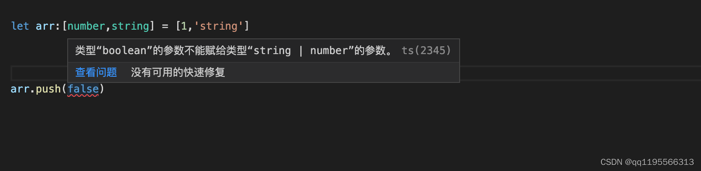

指定返回的类型

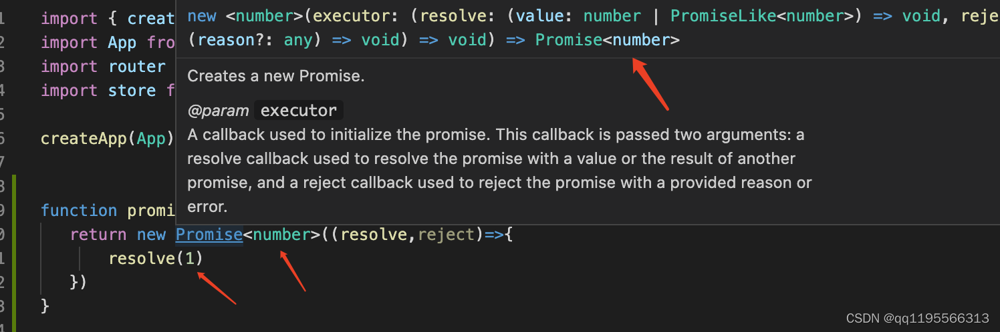

函数定义返回promise 语法规则:Promise&lt;T&gt; 类型&nbsp;

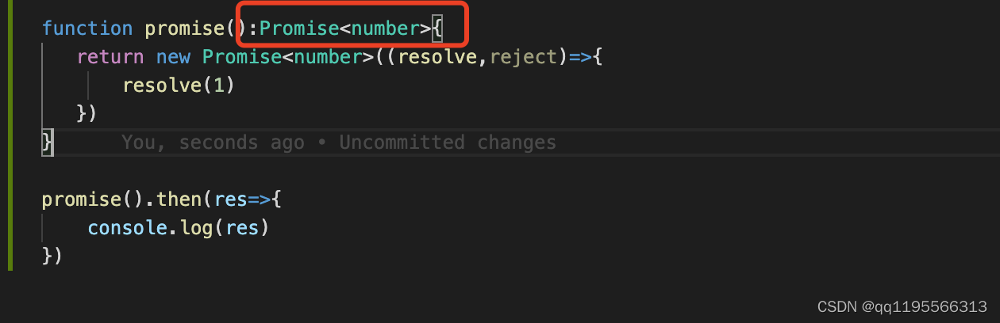

```typescript
function promise(): Promise<number> {
  return new Promise<number>((resolve, reject) => {
    resolve(1)
  })
}

promise().then(res => {
  console.log(res)
})
```

当你在使用一些常用的方法的时候，TypeScript 实际上已经帮你做了很多类型判断的工作了

而他们的定义文件，则在&nbsp; [TypeScript 核心库的定义文件](https://github.com/Microsoft/TypeScript/tree/master/src/lib)中

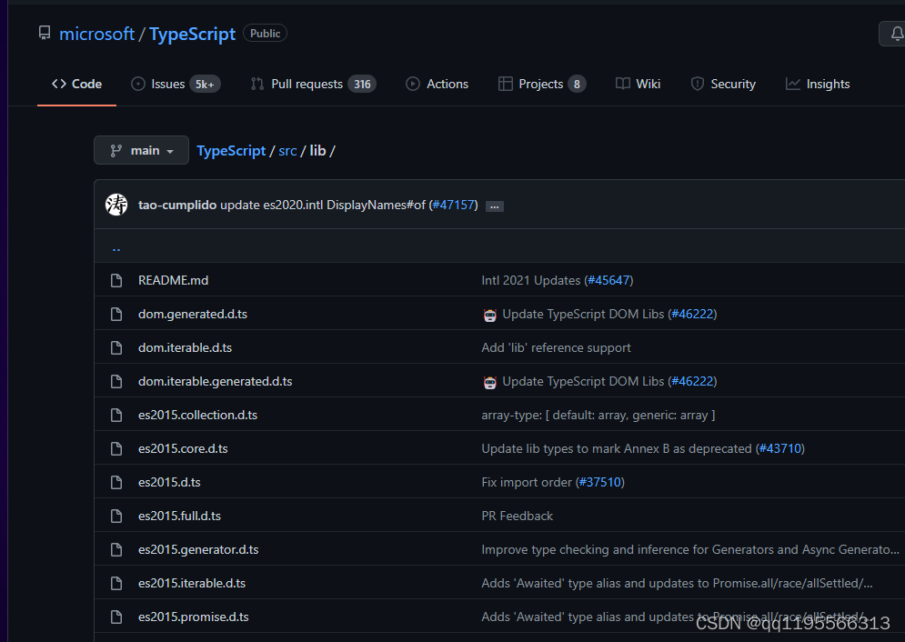

## 代码雨案例

```typescript
let canvas = document.querySelector('#canvas') as HTMLCanvasElement
let ctx = canvas.getContext('2d') as CanvasRenderingContext2D
canvas.height = screen.availHeight; //可视区域的高度
canvas.width = screen.availWidth; //可视区域的宽度
let str: string[] = 'XMZSWSSBXMZSWSSBXMZSWSSBXMZSWSSBXMZSWSSB'.split('')
let Arr = Array(Math.ceil(canvas.width / 10)).fill(0) //获取宽度例如1920 / 10 192
console.log(Arr);

const rain = () => {
  ctx.fillStyle = 'rgba(0,0,0,0.05)'//填充背景颜色
  ctx.fillRect(0, 0, canvas.width, canvas.height)//背景
  ctx.fillStyle = "#0f0"; //文字颜色
  Arr.forEach((item, index) => {
    ctx.fillText(str[Math.floor(Math.random() * str.length)], index * 10, item + 10)
    Arr[index] = item >= canvas.height || item > 10000 * Math.random() ? 0 : item + 10; //添加随机数让字符随机出现不至于那么平整
  })
  console.log(Arr);

}
setInterval(rain, 40)
```


# Class类

ES6提供了更接近传统语言的写法，引入了Class（类）这个概念，作为对象的模板。通过class关键字，可以定义类。基本上，ES6的class可以看作只是一个语法糖，它的绝大部分功能，ES5都可以做到，新的class写法只是让对象原型的写法更加清晰、更像面向对象编程的语法而已。上面的代码用ES6的“类”改写，就是下面这样。

```typescript
//定义类
class Person {
  constructor() {
  }

  run() {
  }
}
```

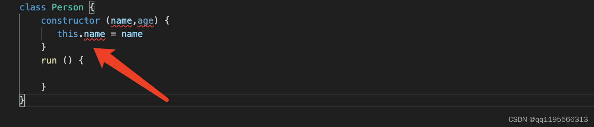

在TypeScript是不允许直接在constructor 定义变量的 需要在constructor上面先声明

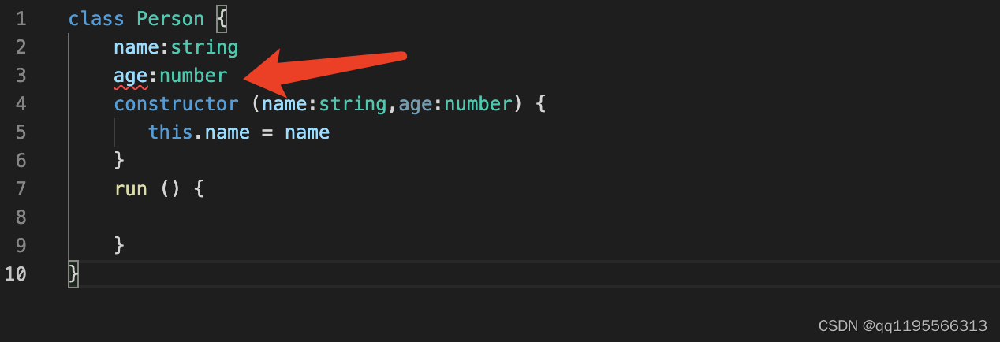

这样引发了第二个问题你如果了定义了变量不用 也会报错 通常是给个默认值 或者 进行赋值

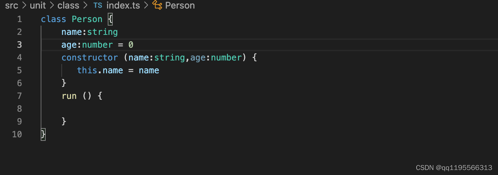

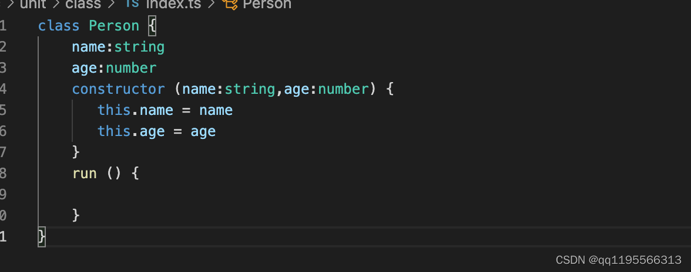

恭喜你已经学会了在class中 如何定义变量

## 修饰符

public、private、protected

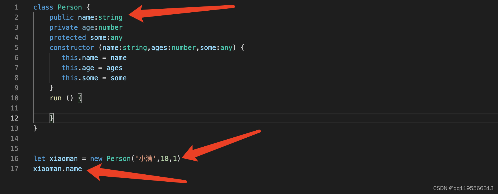

使用public 修饰符 可以让你定义的变量 内部访问 也可以外部访问 如果不写默认就是public

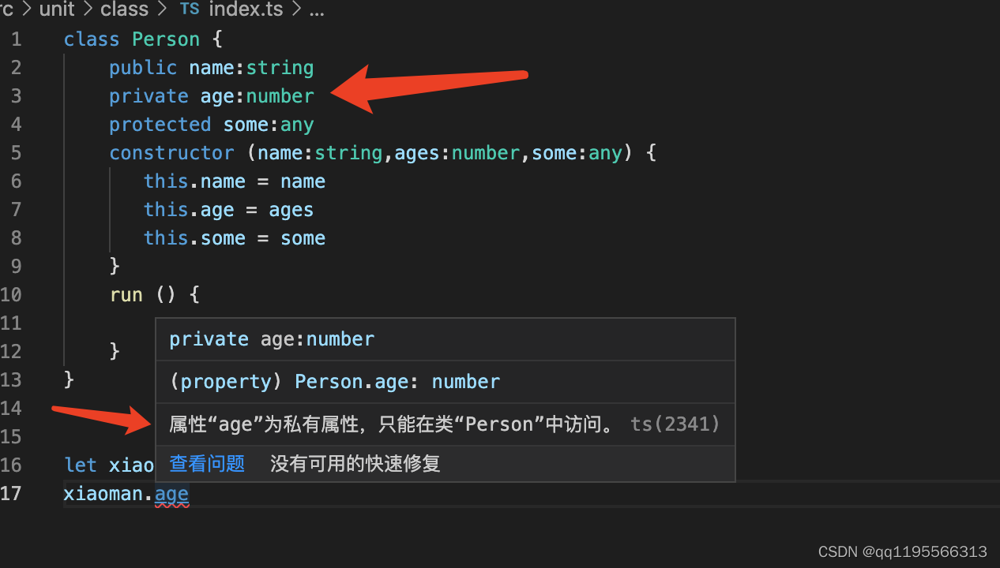

使用&nbsp; private 修饰符 代表定义的变量私有的只能在内部访问 不能在外部访问

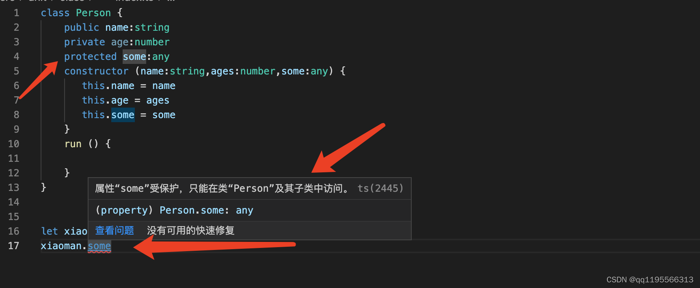

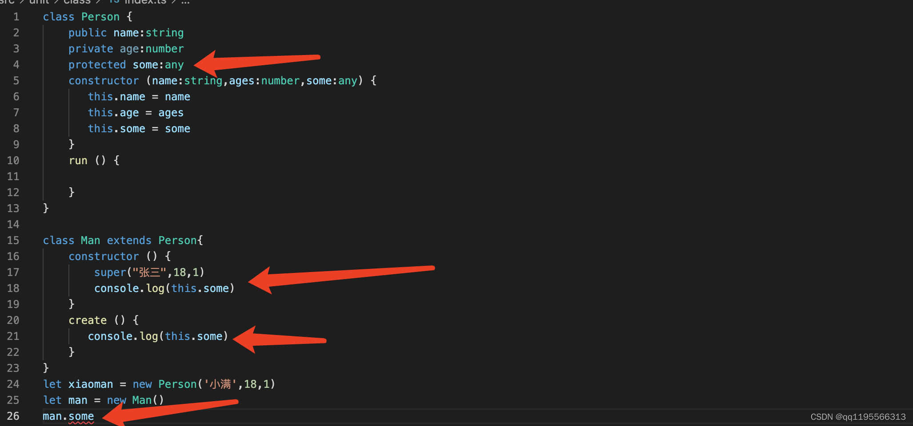
&nbsp;&nbsp;使用&nbsp; protected 修饰符 代表定义的变量私有的只能在内部和继承的子类中访问&nbsp;不能在外部访问

TIPS:代码

```typescript
class Person {
  public name: string
  private age: number
  protected some: any

  constructor(name: string, ages: number, some: any) {
    this.name = name
    this.age = ages
    this.some = some
  }

  run() {

  }
}

class Man extends Person {
  constructor() {
    super("张三", 18, 1)
    console.log(this.some)
  }

  create() {
    console.log(this.some)
  }
}

let xiaoman = new Person('小满', 18, 1)
let man = new Man()
man.some
```

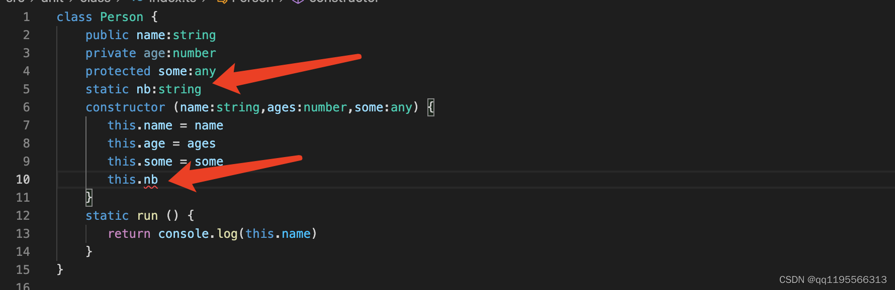

我们用static 定义的属性 不可以通过this 去访问 只能通过类名去调用


static 静态函数 同样也是不能通过this 去调用 也是通过类名去调用

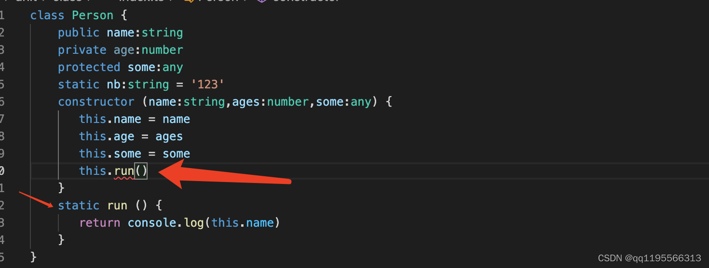

需注意： 如果两个函数都是static 静态的是可以通过this互相调用

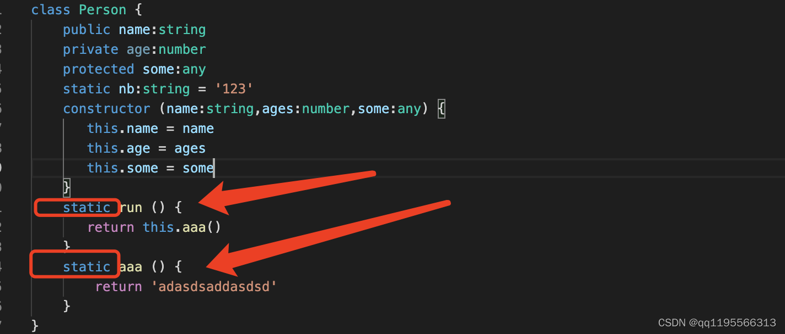

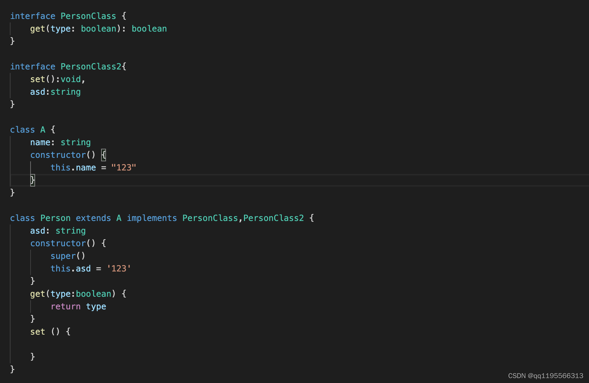

&nbsp;ts interface 定义类 使用关键字&nbsp;implements后面跟interface的名字多个用逗号隔开 继承还是用extends

```typescript
interface PersonClass {
  get(type: boolean): boolean
}

interface PersonClass2 {
  set(): void,

  asd: string
}

class A {
  name: string

  constructor() {
    this.name = "123"
  }
}

class Person extends A implements PersonClass, PersonClass2 {
  asd: string

  constructor() {
    super()
    this.asd = '123'
  }

  get(type: boolean) {
    return type
  }

  set() {

  }
}
```

应用场景如果你写的类实例化之后毫无用处此时我可以把他定义为抽象类

或者你也可以把他作为一个基类-&gt; 通过继承一个派生类去实现基类的一些方法

我们看例子

下面这段代码会报错抽象类无法被实例化

```typescript
abstract class A {
  public name: string

}

new A()
```

例子2

我们在A类定义了 getName 抽象方法但为实现

我们B类实现了A定义的抽象方法 如不实现就不报错 我们定义的抽象方法必须在派生类实现

```typescript
abstract class A {
  name: string

  constructor(name: string) {
    this.name = name;
  }

  print(): string {
    return this.name
  }

  abstract getName(): string
}

class B extends A {
  constructor() {
    super('小满')
  }

  getName(): string {
    return this.name
  }
}

let b = new B();

console.log(b.getName());
```

视频案例

```typescript
//1. class 的基本用法 继承 和 类型约束
//2. class 的修饰符 readonly  private protected public
//3. super 原理
//4. 静态方法
//5. get set
interface Options {
  el: string | HTMLElement
}

interface VueCls {
  init(): void

  options: Options
}

interface Vnode {
  tag: string
  text?: string
  props?: {
    id?: number | string
    key?: number | string | object
  }
  children?: Vnode[]
}

class Dom {
  constructor() {
  }

  private createElement(el: string): HTMLElement {
    return document.createElement(el)
  }

  protected setText(el: Element, text: string | null) {
    el.textContent = text;
  }

  protected render(createElement: Vnode): HTMLElement {
    const el = this.createElement(createElement.tag)
    if (createElement.children && Array.isArray(createElement.children)) {
      createElement.children.forEach(item => {
        const child = this.render(item)
        this.setText(child, item.text ?? null)
        el.appendChild(child)
      })
    } else {
      this.setText(el, createElement.text ?? null)
    }
    return el;
  }
}

class Vue extends Dom implements VueCls {
  options: Options

  constructor(options: Options) {
    super()
    this.options = options;
    this.init()
  }

  static version() {
    return '1.0.0'
  }

  public init() {
    let app = typeof this.options.el == 'string' ? document.querySelector(this.options.el) : this.options.el;
    let data: Vnode = {
      tag: "div",
      props: {
        id: 1,
        key: 1
      },
      children: [
        {
          tag: "div",
          text: "子集1",
        },
        {
          tag: "div",
          text: "子集2"
        }
      ]
    }
    app?.appendChild(this.render(data))
    console.log(app);

    this.mount(app as Element)
  }

  public mount(app: Element) {
    document.body.append(app)
  }
}


const v = new Vue({
  el: "#app"
})
```

# 元组类型

如果需要一个固定大小的不同类型值的集合，我们需要使用元组。&nbsp;

**元组（Tuple）是固定数量的不同类型的元素的组合**。

元组与集合的不同之处在于，元组中的元素类型可以是不同的，而且数量固定。元组的好处在于可以把多个元素作为一个单元传递。如果一个方法需要返回多个值，可以把这多个值作为元组返回，而不需要创建额外的类来表示。

```typescript
let arr: [number, string] = [1, 'string']


let arr2: readonly [number, boolean, string, undefined] = [1, true, 'sring', undefined]
```

当赋值或访问一个已知索引的元素时，会得到正确的类型：

```typescript
let arr: [number, string] = [1, 'string']
arr[0].length //error
arr[1].length //success

//数字是没有length 的
```

元组类型还可以支持自定义名称和变为可选的

```typescript
let a: [x: number, y?: boolean] = [1]
```

```typescript
let arr: [number, string] = [1, 'string']

arr.push(true)//error
```

对于越界的元素他的类型被限制为 联合类型（就是你在元组中定义的类型）如下图


```typescript
let excel: [string, string, number, string][] = [
  ['title', 'name', 1, '123'],
  ['title', 'name', 1, '123'],
  ['title', 'name', 1, '123'],
  ['title', 'name', 1, '123'],
  ['title', 'name', 1, '123'],
]
```

# 枚举类型

在javaScript中是没有枚举的概念的，TS帮我们定义了枚举这个类型

## 1.数字枚举

例如 红绿蓝 Red = 0 Green = 1 Blue= 2 分别代表红色0 绿色为1 蓝色为2

```typescript
enum Types {
  Red,
  Green,
  BLue
}
```

这样写就可以实现应为ts定义的枚举中的每一个组员默认都是从0开始的所以也就是

```typescript
enum Types {
  Red = 0,
  Green = 1,
  BLue = 2
}

//默认就是从0开始的 可以不写值
```

增长枚举

```typescript
enum Types {
  Red = 1,
  Green,
  BLue
}
```

如上，我们定义了一个数字枚举， Red使用初始化为&nbsp;1。 其余的成员会从&nbsp;1开始自动增长。 换句话说，
Type.Red的值为&nbsp;1，&nbsp;Green为&nbsp;2，&nbsp;Blue为&nbsp;3。

## 2.字符串枚举

字符串枚举的概念很简单。 在一个字符串枚举里，每个成员都必须用字符串字面量，或另外一个字符串枚举成员进行初始化。

```typescript
enum Types {
  Red = 'red',
  Green = 'green',
  BLue = 'blue'
}
```

由于字符串枚举没有自增长的行为，字符串枚举可以很好的序列化。
换句话说，如果你正在调试并且必须要读一个数字枚举的运行时的值，这个值通常是很难读的 -
它并不能表达有用的信息，字符串枚举允许你提供一个运行时有意义的并且可读的值，独立于枚举成员的名字。

## 3.异构枚举

枚举可以混合字符串和数字成员

```typescript
enum Types {
  No = "No",
  Yes = 1,
}
```

## 4.接口枚举

定义一个枚举Types 定义一个接口A 他有一个属性red 值为Types.yyds

声明对象的时候要遵循这个规则

```typescript
enum Types {
  yyds,
  dddd
}

interface A {
  red: Types.yyds
}

let obj: A = {
  red: Types.yyds
}
```

## 5.const枚举

let&nbsp; 和 var 都是不允许的声明只能使用const

大多数情况下，枚举是十分有效的方案。 然而在某些情况下需求很严格。 为了避免在额外生成的代码上的开销和额外的非直接的对枚举成员的访问，我们可以使用&nbsp;const枚举。
常量枚举通过在枚举上使用&nbsp;const修饰符来定义

const 声明的枚举会被编译成常量

普通声明的枚举编译完后是个对象

```typescript
const enum Types {
  No = "No",
  Yes = 1,
}
```

Const 声明编译之后

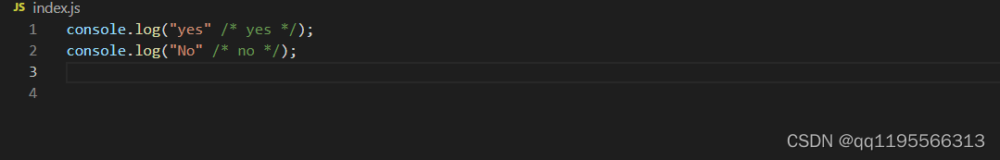

普通声明编译之后

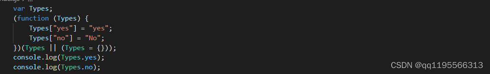

它包含了正向映射（&nbsp;name&nbsp;-&gt;&nbsp;value）和反向映射（&nbsp;value&nbsp;-&gt;&nbsp;name）

要注意的是&nbsp; **不会** 为字符串枚举成员生成反向映射。

```typescript
enum Enum {
  fall
}

let a = Enum.fall;
console.log(a); //0
let nameOfA = Enum[a];
console.log(nameOfA); //fall
```

# 类型推论 | 类型别名

## 什么是类型推论

```
let str = "小满zs"
```

1. 我声明了一个变量但是没有定义类型

TypeScript会在没有明确的指定类型的时候推测出一个类型，这就是类型推论

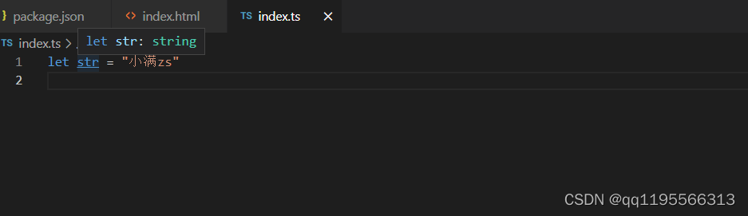

所以TS帮我推断出来这是一个string类型

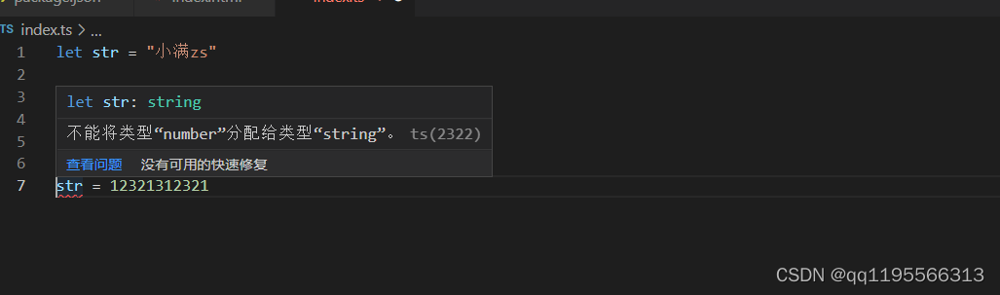

不能够在赋值给别的类型

2. 如果你声明变量没有定义类型也没有赋值这时候TS会推断成any类型可以进行任何操作

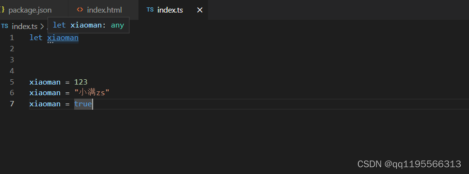

## 类型别名

type 关键字（可以给一个类型定义一个名字）多用于复合类型

```typescript
//定义类型别名
type str = string
let s: str = "我是小满"
console.log(s);

//定义函数别名
type str = () => string
let s: str = () => "我是小满"
console.log(s);

//定义联合类型别名
type str = string | number
let s: str = 123
let s2: str = '123'
console.log(s, s2);

//定义值的别名
type value = boolean | 0 | '213'
let s: value = true
```

type 和 interface 还是一些区别的 虽然都可以定义类型

1. interface可以继承 type 只能通过 & 交叉类型合并

2. type 可以定义 联合类型 和 可以使用一些操作符 interface不行

3. interface 遇到重名的会合并 type 不行

### type高级用法

左边的值会作为右边值的子类型遵循图中上下的包含关系

```TypeScript
type a = 1 extends number ? 1 : 0 //1

type a = 1 extends Number ? 1 : 0 //1

type a = 1 extends Object ? 1 : 0 //1

type a = 1 extends any ? 1 : 0 //1

type a = 1 extends unknow ? 1 : 0 //1

type a = 1 extends never ? 1 : 0 //0
```


# never类型

TypeScript 将使用 never 类型来表示不应该存在的状态

```typescript
// 返回never的函数必须存在无法达到的终点

// 因为必定抛出异常，所以 error 将不会有返回值
function error(message: string): never {
  throw new Error(message);
}

// 因为存在死循环，所以 loop 将不会有返回值
function loop(): never {
  while (true) {
  }
}
```

## never 与 void 的差异

```typescript
//void类型只是没有返回值 但本身不会出错
function Void(): void {
  console.log();
}

//只会抛出异常没有返回值
function Never(): never {
  throw new Error('aaa')
}
```

差异2&nbsp; &nbsp;当我们鼠标移上去的时候会发现 只有void和number&nbsp; &nbsp; never在联合类型中会被直接移除

```typescript
type A = void | number | never
```

## never 类型的一个应用场景

举一个我们可能会见到的例子

```typescript
type A = '小满' | '大满' | '超大满'

function isXiaoMan(value: A) {
  switch (value) {
    case "小满":
      break
    case "大满":
      break
    case "超大满":
      break
    default:
      //是用于场景兜底逻辑
      const error: never = value;
      return error
  }
}
```

比如新来了一个同事他新增了一个篮球，我们必须手动找到所有 switch 代码并处理，否则将有可能引入 BUG 。

而且这将是一个“隐蔽型”的BUG，如果回归面不够广，很难发现此类BUG。

那 TS 有没有办法帮助我们在类型检查阶段发现这个问题呢？

```typescript
type A = '小满' | '大满' | '超大满' | "小小满"

function isXiaoMan(value: A) {
  switch (value) {
    case "小满":
      break
    case "大满":
      break
    case "超大满":
      break
    default:
      //是用于场景兜底逻辑
      const error: never = value;
      return error
  }
}
```

由于任何类型都不能赋值给&nbsp;never&nbsp;类型的变量，所以当存在进入&nbsp;default&nbsp;分支的可能性时，TS的类型检查会及时帮我们发现这个问题

# symbol类型

**自ECMAScript 2015起，`symbol`成为了一种新的原生类型，就像`number`和`string`一样。**

symbol类型的值是通过Symbol构造函数创建的。

可以传递参做为唯一标识 只支持 string 和 number类型的参数

```typescript
let sym1 = Symbol();
let sym2 = Symbol("key"); // 可选的字符串key
```

Symbol的值是唯一的

```typescript
const s1 = Symbol()
const s2 = Symbol()
// s1 === s2 =>false
```

用作对象属性的键

```typescript
let sym = Symbol();

let obj = {
  [sym]: "value"
};

console.log(obj[sym]); // "value"
```

使用symbol定义的属性，是不能通过如下方式遍历拿到的

```typescript
const symbol1 = Symbol('666')
const symbol2 = Symbol('777')
const obj1 = {
  [symbol1]: '小满',
  [symbol2]: '二蛋',
  age: 19,
  sex: '女'
}
// 1 for in 遍历
for (const key in obj1) {
  // 注意在console看key,是不是没有遍历到symbol1
  console.log(key)
}
// 2 Object.keys 遍历
Object.keys(obj1)
console.log(Object.keys(obj1))
// 3 getOwnPropertyNames
console.log(Object.getOwnPropertyNames(obj1))
// 4 JSON.stringfy
console.log(JSON.stringify(obj1))
```

如何拿到

```typescript
// 1 拿到具体的symbol 属性,对象中有几个就会拿到几个
Object.getOwnPropertySymbols(obj1)
console.log(Object.getOwnPropertySymbols(obj1))
// 2 es6 的 Reflect 拿到对象的所有属性
Reflect.ownKeys(obj1)
console.log(Reflect.ownKeys(obj1))
```

### Symbol.iterator 迭代器 和 生成器 for of

支持遍历大部分类型迭代器 arr nodeList argumetns set map 等

```typescript
var arr = [1, 2, 3, 4];
let iterator = arr[Symbol.iterator]();

console.log(iterator.next());  //{ value: 1, done: false }
console.log(iterator.next());  //{ value: 2, done: false }
console.log(iterator.next());  //{ value: 3, done: false }
console.log(iterator.next());  //{ value: 4, done: false }
console.log(iterator.next());  //{ value: undefined, done: true }
```

测试用例

```typescript
interface Item {
  age: number,
  name: string
}

const array: Array<Item> = [{ age: 123, name: "1" }, { age: 123, name: "2" }, { age: 123, name: "3" }]

type mapTypes = string | number
const map: Map<mapTypes, mapTypes> = new Map()

map.set('1', '王爷')
map.set('2', '陆北')

const obj = {
  aaa: 123,
  bbb: 456
}

let set: Set<number> = new Set([1, 2, 3, 4, 5, 6])
// let it:Iterator<Item> = array[Symbol.iterator]()
const gen = (erg: any): void => {
  let it: Iterator<any> = erg[Symbol.iterator]()
  let next: any = { done: false }
  while (!next.done) {
    next = it.next()
    if (!next.done) {
      console.log(next.value)
    }
  }
}
gen(array)
```

我们平时开发中不会手动调用iterator 应为 他是有语法糖的就是for of&nbsp; 记住 for of
是不能循环对象的应为对象没有&nbsp;iterator&nbsp;&nbsp;

```typescript
for (let value of map) {
  console.log(value)
}
```

数组解构的原理其实也是调用迭代器的

```typescript
var [a, b, c] = [1, 2, 3]

var x = [...xxxx]
```

&nbsp;那我们可以自己实现一个迭代器让对象支持for of

```typescript
const obj = {
  max: 5,
  current: 0,
  [Symbol.iterator]() {
    return {
      max: this.max,
      current: this.current,
      next() {
        if (this.current == this.max) {
          return {
            value: undefined,
            done: true
          }
        } else {
          return {
            value: this.current++,
            done: false
          }
        }
      }
    }
  }
}
console.log([...obj])

for (let val of obj) {
  console.log(val);

}
```

以下为这些symbols的列表：

**Symbol.hasInstance** 方法，会被instanceof运算符调用。构造器对象用来识别一个对象是否是其实例。

**Symbol.isConcatSpreadable** 布尔值，表示当在一个对象上调用Array.prototype.concat时，这个对象的数组元素是否可展开。

**Symbol.iterator** 方法，被for-of语句调用。返回对象的默认迭代器。

**Symbol.match** 方法，被String.prototype.match调用。正则表达式用来匹配字符串。

**Symbol.replace** 方法，被String.prototype.replace调用。正则表达式用来替换字符串中匹配的子串。

**Symbol.search** 方法，被String.prototype.search调用。正则表达式返回被匹配部分在字符串中的索引。

**Symbol.species** 函数值，为一个构造函数。用来创建派生对象。

**Symbol.split** 方法，被String.prototype.split调用。正则表达式来用分割字符串。

**Symbol.toPrimitive** 方法，被ToPrimitive抽象操作调用。把对象转换为相应的原始值。

**Symbol.toStringTag** 方法，被内置方法Object.prototype.toString调用。返回创建对象时默认的字符串描述。

**Symbol.unscopables** 对象，它自己拥有的属性会被with作用域排除在外。

# 泛型

泛型在TypeScript 是很重要的东西 例如vue3 是用ts编写的 里面用到了非常多的泛型

ok:我们看一个小例子

## 函数泛型

我写了两个函数一个是数字类型的函数，另一个是字符串类型的函数,其实就是类型不同，

实现的功能是一样的，这时候我们就可以使用泛型来优化

```typescript
function num(a: number, b: number): Array<number> {
  return [a, b];
}

num(1, 2)

function str(a: string, b: string): Array<string> {
  return [a, b];
}

str('独孤', '求败')
```

泛型优化

语法为函数名字后面跟一个&lt;参数名&gt; 参数名可以随便写 例如我这儿写了T

当我们使用这个函数的时候把参数的类型传进去就可以了 （也就是动态类型）

```typescript
function Add<T>(a: T, b: T): Array<T> {
  return [a, b]
}

Add<number>(1, 2)
Add<string>('1', '2')
```

我们也可以使用不同的泛型参数名，只要在数量上和使用方式上能对应上就可以。

```typescript
function Sub<T, U>(a: T, b: U): Array<T | U> {
  const params: Array<T | U> = [a, b]
  return params
}


Sub<Boolean, number>(false, 1)
```

## 定义泛型接口

声明接口的时候 在名字后面加一个&lt;参数&gt;

使用的时候传递类型

```typescript
interface MyInter<T> {
  (arg: T): T
}

function fn<T>(arg: T): T {
  return arg
}

let result: MyInter<number> = fn

result(123)
```

## 对象字面量泛型

```typescript
let foo: { <T>(arg: T): T }

foo = function <T>(arg: T): T {
  return arg
}

foo(123)
```

## 泛型约束

我们期望在一个泛型的变量上面，获取其length参数，但是，有的数据类型是没有length属性的

```typescript
function getLegnth<T>(arg: T) {
  return arg.length
}
```

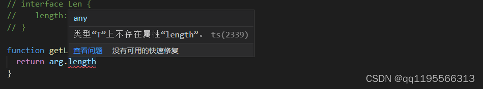
&nbsp;这时候我们就可以使用泛型约束

于是，我们就得对使用的泛型进行约束，我们约束其为具有length属性的类型，这里我们会用到interface,代码如下

```typescript
interface Len {
  length: number
}

function getLegnth<T extends Len>(arg: T) {
  return arg.length
}

getLegnth<string>('123')
```

## 使用keyof 约束对象

其中使用了TS泛型和泛型约束。首先定义了T类型并使用extends关键字继承object类型的子类型，然后使用keyof操作符获取T类型的所有键，它的返回
类型是联合 类型，最后利用extends关键字约束 K类型必须为keyof T联合类型的子类型

```typescript
function prop<T, K extends keyof T>(obj: T, key: K) {
  return obj[key]
}


let o = { a: 1, b: 2, c: 3 }

prop(o, 'a')
prop(o, 'd') //此时就会报错发现找不到
```

## 泛型类

声明方法跟函数类似名称后面定义&lt;类型&gt;

使用的时候确定类型new Sub&lt;number&gt;()

```typescript
class Sub<T> {
  attr: T[] = [];

  add(a: T): T[] {
    return [a]
  }
}

let s = new Sub<number>()
s.attr = [1, 2, 3]
s.add(123)

let str = new Sub<string>()
str.attr = ['1', '2', '3']
str.add('123')
```

# tsconfig.json配置文件

## 生成tsconfig.json 文件

这个文件是通过tsc --init命令生成的

## 配置详解

```typescript
"compilerOptions"
:
{
  "incremental"
:
  true, // TS编译器在第一次编译之后会生成一个存储编译信息的文件，第二次编译会在第一次的基础上进行增量编译，可以提高编译的速度
    "tsBuildInfoFile"
:
  "./buildFile", // 增量编译文件的存储位置
    "diagnostics"
:
  true, // 打印诊断信息 
    "target"
:
  "ES5", // 目标语言的版本
    "module"
:
  "CommonJS", // 生成代码的模板标准
    "outFile"
:
  "./app.js", // 将多个相互依赖的文件生成一个文件，可以用在AMD模块中，即开启时应设置"module": "AMD",
    "lib"
:
  ["DOM", "ES2015", "ScriptHost", "ES2019.Array"], // TS需要引用的库，即声明文件，es5 默认引用dom、es5、scripthost,如需要使用es的高级版本特性，通常都需要配置，如es8的数组新特性需要引入"ES2019.Array",
    "allowJS"
:
  true, // 允许编译器编译JS，JSX文件
    "checkJs"
:
  true, // 允许在JS文件中报错，通常与allowJS一起使用
    "outDir"
:
  "./dist", // 指定输出目录
    "rootDir"
:
  "./", // 指定输出文件目录(用于输出)，用于控制输出目录结构
    "declaration"
:
  true, // 生成声明文件，开启后会自动生成声明文件
    "declarationDir"
:
  "./file", // 指定生成声明文件存放目录
    "emitDeclarationOnly"
:
  true, // 只生成声明文件，而不会生成js文件
    "sourceMap"
:
  true, // 生成目标文件的sourceMap文件
    "inlineSourceMap"
:
  true, // 生成目标文件的inline SourceMap，inline SourceMap会包含在生成的js文件中
    "declarationMap"
:
  true, // 为声明文件生成sourceMap
    "typeRoots"
:
  [], // 声明文件目录，默认时node_modules/@types
    "types"
:
  [], // 加载的声明文件包
    "removeComments"
:
  true, // 删除注释 
    "noEmit"
:
  true, // 不输出文件,即编译后不会生成任何js文件
    "noEmitOnError"
:
  true, // 发送错误时不输出任何文件
    "noEmitHelpers"
:
  true, // 不生成helper函数，减小体积，需要额外安装，常配合importHelpers一起使用
    "importHelpers"
:
  true, // 通过tslib引入helper函数，文件必须是模块
    "downlevelIteration"
:
  true, // 降级遍历器实现，如果目标源是es3/5，那么遍历器会有降级的实现
    "strict"
:
  true, // 开启所有严格的类型检查
    "alwaysStrict"
:
  true, // 在代码中注入'use strict'
    "noImplicitAny"
:
  true, // 不允许隐式的any类型
    "strictNullChecks"
:
  true, // 不允许把null、undefined赋值给其他类型的变量
    "strictFunctionTypes"
:
  true, // 不允许函数参数双向协变
    "strictPropertyInitialization"
:
  true, // 类的实例属性必须初始化
    "strictBindCallApply"
:
  true, // 严格的bind/call/apply检查
    "noImplicitThis"
:
  true, // 不允许this有隐式的any类型
    "noUnusedLocals"
:
  true, // 检查只声明、未使用的局部变量(只提示不报错)
    "noUnusedParameters"
:
  true, // 检查未使用的函数参数(只提示不报错)
    "noFallthroughCasesInSwitch"
:
  true, // 防止switch语句贯穿(即如果没有break语句后面不会执行)
    "noImplicitReturns"
:
  true, //每个分支都会有返回值
    "esModuleInterop"
:
  true, // 允许export=导出，由import from 导入
    "allowUmdGlobalAccess"
:
  true, // 允许在模块中全局变量的方式访问umd模块
    "moduleResolution"
:
  "node", // 模块解析策略，ts默认用node的解析策略，即相对的方式导入
    "baseUrl"
:
  "./", // 解析非相对模块的基地址，默认是当前目录
    "paths"
:
  { // 路径映射，相对于baseUrl
    // 如使用jq时不想使用默认版本，而需要手动指定版本，可进行如下配置
    "jquery"
  :
    ["node_modules/jquery/dist/jquery.min.js"]
  }
,
  "rootDirs"
:
  ["src", "out"], // 将多个目录放在一个虚拟目录下，用于运行时，即编译后引入文件的位置可能发生变化，这也设置可以虚拟src和out在同一个目录下，不用再去改变路径也不会报错
    "listEmittedFiles"
:
  true, // 打印输出文件
    "listFiles"
:
  true// 打印编译的文件(包括引用的声明文件)
}

// 指定一个匹配列表（属于自动指定该路径下的所有ts相关文件）
"include"
:
[
  "src/**/*"
],
// 指定一个排除列表（include的反向操作）
  "exclude"
:
[
  "demo.ts"
],
// 指定哪些文件使用该配置（属于手动一个个指定文件）
  "files"
:
[
  "demo.ts"
]
```

&nbsp;介绍几个常用的

-

include - 指定编译文件默认是编译当前目录下所有的ts文件

-

exclude - 指定排除的文件

-

target - 指定编译js 的版本例如es5&nbsp; es6

-

allowJS - 是否允许编译js文件

-

removeComments - 是否在编译过程中删除文件中的注释

-

rootDir - 编译文件的目录

-

outDir - 输出的目录

-

sourceMap - 代码源文件

-

strict - 严格模式

-

module - 默认common.js&nbsp; 可选es6模式 amd&nbsp; umd 等
