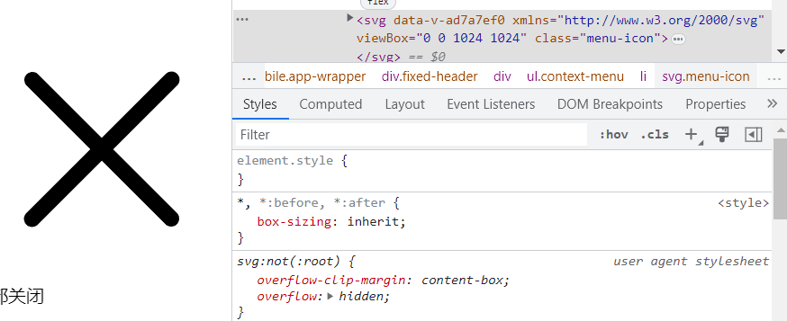
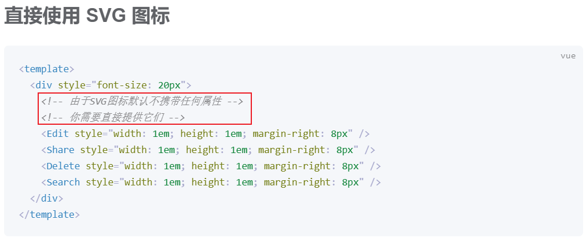
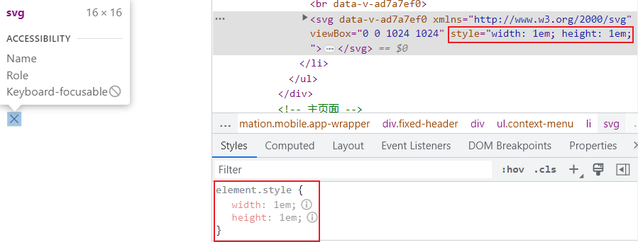

## 问题

在使用`el-icon`内置图标时，如果单独使用`svg`，那么通过添加`class`设置`css`则无效果:

```vue
...
<close class="menu-icon" />
...

<style scoped>
  .menu-icon {
    width: 1em;
    height: 1em;
  }
</style>
```

可以看到，显示有类名`menu-icon`，却并未应用`css`属性



## 解决方案

参考官方文档



### 方案1

直接在标签内提供要设置的`style`属性



### 方案2

也可以在外边包裹一层<el-icon>，通过给`el-icon`添加`class`来控制里面的`svg`图标

```
<el-icon class="menu-icon">
  <close />
</el-icon>
```


