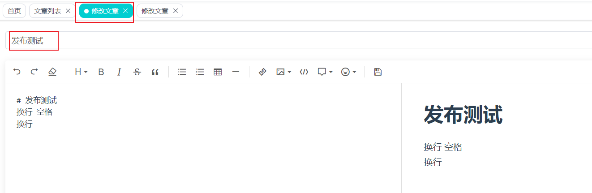

## 问题描述

在使用`<keep-alive>`标签搭配带参数的路由匹配时，出现了以下问题：

在下图页面中，点击‘编辑’按钮将跳转至`/article/edit/:articleId`页面


由于我使用了`keep-alive`标签

```vue

<router-view v-slot="{ Component }">
  <transition mode="out-in" name="el-fade-in-linear">
    <keep-alive>
      <component :is="Component" />
    </keep-alive>
  </transition>
</router-view>
```

导致在切换编辑页面时，始终是同一个文章的编辑页面，即首次缓存的页面




且此时的url是正确的，分别为`http://localhost:8082/article/edit/1` `http://localhost:8082/article/edit/2`

## 解决方案

研究发现，<keep-alive>中的<component>标签可以设置key属性，将key设置为路由的path即可解决跳转问题

```vue

<router-view v-slot="{ Component, route }">
  <transition mode="out-in" name="el-fade-in-linear">
    <keep-alive>
      <component :is="Component" :key="route.path" />
    </keep-alive>
  </transition>
</router-view>
```

注：对于restful风格的页面，设置为path即可，不然要设置为fullpath