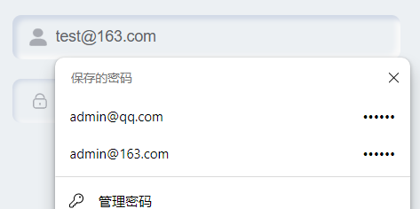
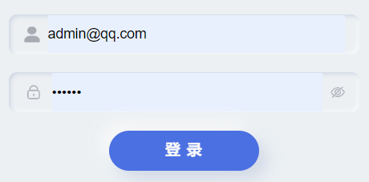
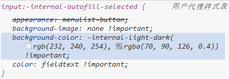
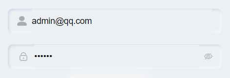
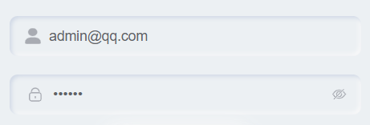

## 问题描述

现在浏览器一般都带有自动保存账号密码的功能



但选择账号之后输入框背景色会发生变化，如果输入框是原始方形输入框那倒还好，但若输入框有一定样式(如下图)，那将会变得非常难看



## 解决

按f12查看css后，发现有这样一个伪类：:-internal-autofill-selected



但这个伪类无法直接在css中选择，会报错

不过却发现了另一个伪类：-webkit-autofill

但在这个伪类中设置背景色无效，需要设置box-shadow

```css
input:-webkit-autofill {
    -webkit-box-shadow: 0 0 0 1000px #ecf0f3 inset;
}
```



不过这样依然很丑，因为输入框内部阴影被遮住了

最后，选择延迟颜色变化的动画，即在很久很久之后在变化颜色，这样的话短期内(99999秒约为27小时)不会有什么影响

```css
input:-webkit-autofill {
    -webkit-transition: color 99999s ease-out, background-color 99999s ease-out;
}
```



### 注意：

-webkit-autofill伪类只在不带scoped的style块中生效

-webkit-autofill是用于控制表单自动填充的样式，而scoped属性用于限制样式的作用范围。由于自动填充是浏览器级别的操作，它不受样式的作用范围限制。因此，在<style scoped>
标签中设置-webkit-autofill伪类不会生效。